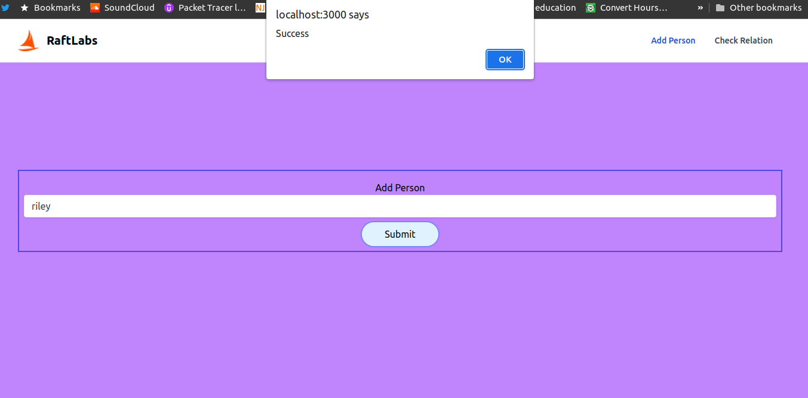
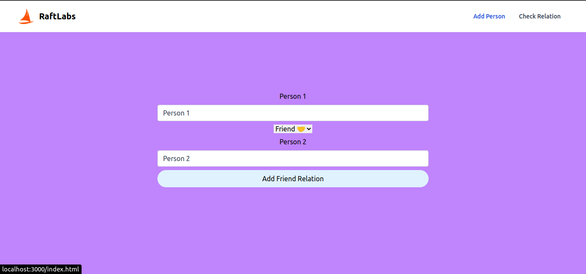
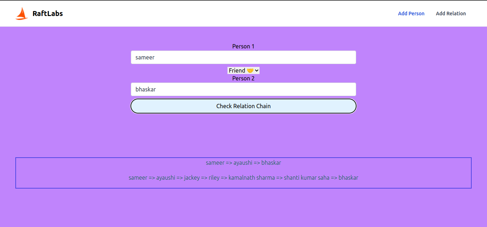

Assignment no 1 : Social Connections

To run simply :-

npm i 

npm start

made with nodejs,html,tailwind css,vanila javascript,nedb for data storage.

#demo link host glitch

[Glitch link] "https://joyous-green-cheque.glitch.me/" 

#for code hands-on

[Glitch IDE] "https://glitch.com/edit/#!/joyous-green-cheque?path=readme.md%3A1%3A0" 

Screenshot 

